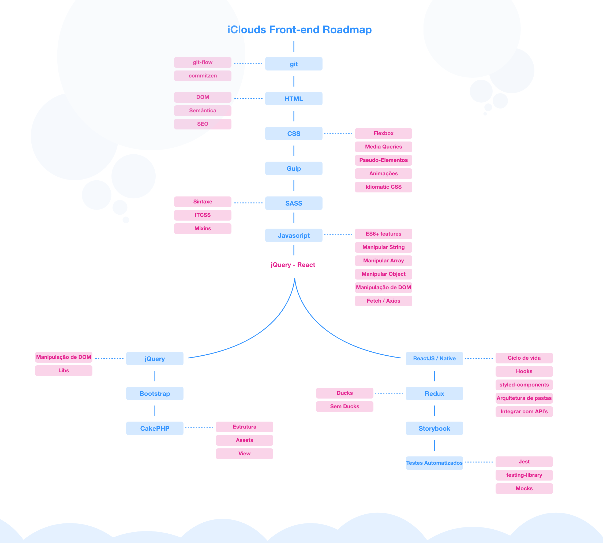

# iClouds Roadmaps

O roadmap da stack estabelecida na empresa

---

## **Front-end**

### Roadmap

### Links

> git

- <a href="https://www.youtube.com/watch?v=2alg7MQ6_sI&">Git (Tutorial Rocketseat)</a>
- <a href="https://danielkummer.github.io/git-flow-cheatsheet/">Git Flow</a>
- <a href="https://github.com/commitizen/cz-cli">Commitzen</a>

> HTML

- <a href="https://developer.mozilla.org/pt-BR/docs/Web/HTML">Basico</a>
- <a href="https://developer.mozilla.org/pt-BR/docs/Glossario/DOM">DOM</a>
- <a href="https://developer.mozilla.org/pt-BR/docs/Glossario/Semantica">Semântica</a>
- <a href="https://www.link-assistant.com/news/html-tags-for-seo.html">SEO</a>

> CSS

- <a href="https://css-tricks.com/snippets/css/a-guide-to-flexbox/">Flexbox</a>
- <a href="https://developer.mozilla.org/pt-BR/docs/Web/Guide/CSS/CSS_Media_queries">Media Queries</a>
- <a href="https://developer.mozilla.org/pt-BR/docs/Web/CSS/Pseudo-elementos">Pseudo Elementos</a>
- <a href="https://www.youtube.com/watch?v=GykTLqODQuU">Animations (aula rocketseat)</a>
- <a href="https://github.com/necolas/idiomatic-css">Idiomatic CSS</a>
